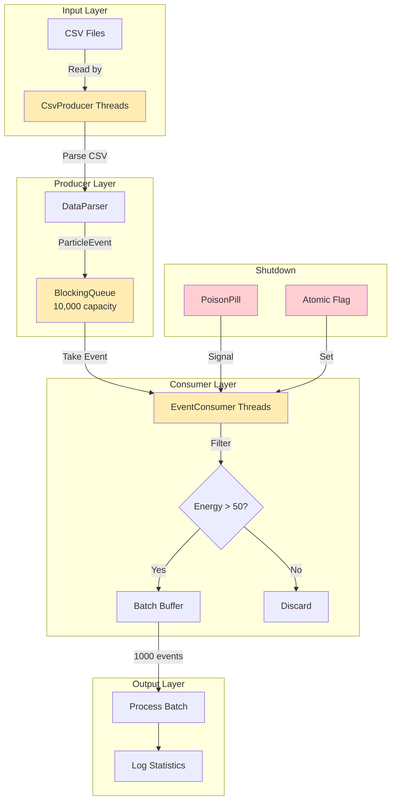

# Architecture Diagrams

## 1. System Architecture



## 2. Class Hierarchy

```
┌─────────────────────────────────────────────────────────────┐
│                    LHC Event Processor                       │
└─────────────────────────────────────────────────────────────┘
                              │
          ┌───────────────────┼───────────────────┐
          │                   │                   │
   ┌──────▼──────┐    ┌───────▼───────┐    ┌─────▼──────┐
   │    Model    │    │   Ingestion  │    │   Main     │
   └──────┬──────┘    └───────┬───────┘    └────────────┘
          │                   │
     ┌────▼────┐      ┌──────┼───────┐
     │Particle │      │      │       │
     │  Event  │      │Data │Csv    │Event │Poison │Pipeline│
     │(POJO)   │      │Parser│Parser│Consumer│Pill  │Manager │
     └─────────┘      │(Interface) │     │       │       │
                      └──────┬──────┴─────┴───────┴───────┘
                             │
                        ┌────▼─────┐
                        │ParseException│
                        └─────────────┘
```

## 3. Producer-Consumer Flow

```
┌──────────────────────────────────────────────────────────────┐
│                    Production Phase                          │
├──────────────────────────────────────────────────────────────┤
│                                                              │
│  ┌──────────────┐      ┌──────────────┐                     │
│  │ CsvProducer  │─────▶│ BlockingQueue │                     │
│  │   Thread 1   │      │              │                     │
│  └──────────────┘      │   [Event]    │                     │
│                        │   [Event]    │                     │
│  ┌──────────────┐      │   [Event]    │                     │
│  │ CsvProducer  │─────▶│   [Event]    │◀─── BLOCKS WHEN   │
│  │   Thread 2   │      │   [Event]    │     FULL           │
│  └──────────────┘      │   [Event]    │                     │
│                        └──────┬───────┘                     │
│                               │                             │
└───────────────────────────────┼───────────────────────────────┘
                                │
                                ▼
┌──────────────────────────────────────────────────────────────┐
│                    Consumption Phase                         │
├──────────────────────────────────────────────────────────────┤
│                                                              │
│  ┌──────────────┐      ┌──────────────┐                     │
│  │ EventConsumer│◀─────│ BlockingQueue │                     │
│  │   Thread 1   │      │              │                     │
│  └──────────────┘      │   [Event]    │◀─── BLOCKS WHEN   │
│                        │   [Event]    │     EMPTY          │
│  ┌──────────────┐      │   [Event]    │                     │
│  │ EventConsumer│◀─────│   [Event]    │                     │
│  │   Thread 2   │      │   [Event]    │                     │
│  └──────────────┘      └──────────────┘                     │
│         │                                                   │
│         ▼                                                   │
│  ┌─────────────────────────────────┐                      │
│  │  Filter: Energy > 50 GeV?        │                      │
│  │  YES → Add to batch (1000)       │                      │
│  │  NO  → Discard                   │                      │
│  └─────────────────────────────────┘                      │
│                                                              │
└──────────────────────────────────────────────────────────────┘
```

## 4. Graceful Shutdown Sequence

```
┌──────────────────────────────────────────────────────────────┐
│                   Normal Operation                           │
├──────────────────────────────────────────────────────────────┤
│                                                              │
│  Producers ───▶ Queue ───▶ Consumers ───▶ Processing         │
│                                                              │
└──────────────────────────────────────────────────────────────┘
                              │
                              ▼
┌──────────────────────────────────────────────────────────────┐
│                   File Reading Complete                        │
├──────────────────────────────────────────────────────────────┤
│                                                              │
│  1. Producer threads finish reading                          │
│  2. ProducerPool.shutdown() called                           │
│  3. ProducerPool.awaitTermination() blocks until done        │
│                                                              │
└──────────────────────────────────────────────────────────────┘
                              │
                              ▼
┌──────────────────────────────────────────────────────────────┐
│                   Poison Pill Injection                        │
├──────────────────────────────────────────────────────────────┤
│                                                              │
│  For each consumer:                                          │
│    queue.put(poisonPill)                                     │
│                                                              │
│  Set termination flag:                                       │
│    poisonPill.signalTermination()                            │
│                                                              │
└──────────────────────────────────────────────────────────────┘
                              │
                              ▼
┌──────────────────────────────────────────────────────────────┐
│                   Consumer Shutdown                           │
├──────────────────────────────────────────────────────────────┤
│                                                              │
│  Consumer loop:                                              │
│    while (!interrupted) {                                    │
│      event = queue.poll(1, SEC)                              │
│      if (event == null && shouldTerminate()) break;         │
│      if (isPoisonPill(event)) break;                         │
│      process(event)                                          │
│    }                                                         │
│                                                              │
│  Finally:                                                    │
│    flush remaining batch                                     │
│    log statistics                                            │
│                                                              │
└──────────────────────────────────────────────────────────────┘
                              │
                              ▼
┌──────────────────────────────────────────────────────────────┐
│                   Final Shutdown                             │
├──────────────────────────────────────────────────────────────┤
│                                                              │
│  1. ConsumerPool.shutdown() called                           │
│  2. ConsumerPool.awaitTermination() blocks until done        │
│  3. PipelineManager reports final statistics                 │
│  4. System exits cleanly                                     │
│                                                              │
└──────────────────────────────────────────────────────────────┘
```

## 5. Thread Pool Configuration

```
┌──────────────────────────────────────────────────────────────┐
│                    Producer Pool                              │
├──────────────────────────────────────────────────────────────┤
│  Threads: 4 (default)                                         │
│  Task: Read CSV files and parse events                       │
│  Type: I/O-bound                                              │
│  Strategy: Fixed thread pool                                  │
│                                                              │
│  ┌────────┐  ┌────────┐  ┌────────┐  ┌────────┐             │
│  │ P-Thread│  │ P-Thread│  │ P-Thread│  │ P-Thread│            │
│  │   #1   │  │   #2   │  │   #3   │  │   #4   │            │
│  └────────┘  └────────┘  └────────┘  └────────┘            │
│      │           │           │           │                    │
│      └───────────┴───────────┴───────────┘                    │
│                          │                                    │
│                          ▼                                    │
│                    BlockingQueue                              │
└──────────────────────────────────────────────────────────────┘

┌──────────────────────────────────────────────────────────────┐
│                    Consumer Pool                              │
├──────────────────────────────────────────────────────────────┤
│  Threads: 4 (default)                                         │
│  Task: Filter and batch process events                       │
│  Type: CPU-bound + I/O (statistics)                         │
│  Strategy: Fixed thread pool                                  │
│                                                              │
│                    BlockingQueue                              │
│                          │                                    │
│      ┌───────────┬───────┴───────┬───────────┐              │
│      │           │               │           │              │
│  ┌───▼───┐   ┌───▼───┐       ┌───▼───┐   ┌───▼───┐         │
│  │C-Thread│   │C-Thread│       │C-Thread│   │C-Thread│        │
│  │  #1   │   │  #2   │       │  #3   │   │  #4   │         │
│  └───────┘   └───────┘       └───────┘   └───────┘         │
└──────────────────────────────────────────────────────────────┘
```

## 6. Data Flow

```
CSV File Line:
"550e8400-e29b-41d4-a716-446655440000,2024-01-15T10:30:00Z,125.50,MUON,true"

│
├─▶ CsvProducer.readLine()
│   └─▶ "550e8400-e29b-41d4-a716-446655440000,2024-01-15T10:30:00Z,125.50,MUON,true"
│
├─▶ CsvParser.parse(line)
│   ├─▶ eventId: UUID.fromString(...)
│   ├─▶ timestamp: Instant.parse(...)
│   ├─▶ energyGev: Double.parseDouble(...) → 125.50
│   ├─▶ particleType: ParticleType.MUON
│   └─▶ detectedAtTracker: true
│
├─▶ ParticleEvent object
│   ├─▶ eventId = 550e8400-e29b-41d4-a716-446655440000
│   ├─▶ timestamp = 2024-01-15T10:30:00Z
│   ├─▶ energyGev = 125.50
│   ├─▶ particleType = MUON
│   └─▶ detectedAtTracker = true
│
├─▶ BlockingQueue.put(event)
│   └─▶ If queue full: BLOCK until space available
│
├─▶ EventConsumer.take()
│   └─▶ If queue empty: BLOCK until event available
│
├─▶ Energy Filter: 125.50 > 50.0 → TRUE
│   └─▶ Add to batch buffer
│
├─▶ Batch Size Check: 1000 events reached?
│   ├─▶ YES → processBatch()
│   │   ├─▶ Calculate avg energy
│   │   ├─▶ Calculate max energy
│   │   └─▶ Log statistics
│   └─▶ NO → continue accumulating
│
└─▶ Statistics Updated
    ├─▶ eventCounter++
    ├─▶ highEnergyCounter++
    └─▶ totalConsumed++
```

## 7. Memory Layout

```
┌──────────────────────────────────────────────────────────────┐
│                    JVM Heap                                   │
├──────────────────────────────────────────────────────────────┤
│                                                              │
│  ┌──────────────────────────────────────────────────────┐  │
│  │  BlockingQueue (10,000 events)                       │  │
│  │  ~1MB (10,000 × 100 bytes/event)                     │  │
│  └──────────────────────────────────────────────────────┘  │
│                                                              │
│  ┌────────────┐  ┌────────────┐  ┌────────────┐          │
│  │Consumer #1 │  │Consumer #2 │  │Consumer #N │          │
│  │Batch Buffer│  │Batch Buffer│  │Batch Buffer│          │
│  │  ~100KB    │  │  ~100KB    │  │  ~100KB    │          │
│  │  (1000 ev) │  │  (1000 ev) │  │  (1000 ev) │          │
│  └────────────┘  └────────────┘  └────────────┘          │
│                                                              │
│  ┌────────────┐  ┌────────────┐  ┌────────────┐          │
│  │Producer #1 │  │Producer #2 │  │Producer #N │          │
│  │Read Buffer │  │Read Buffer │  │Read Buffer │          │
│  │  ~64KB     │  │  ~64KB     │  │  ~64KB     │          │
│  └────────────┘  └────────────┘  └────────────┘          │
│                                                              │
│  Total: ~2-3MB for core data structures                     │
│  + JVM overhead, metadata, stacks                           │
│  Recommended: -Xmx2g                                        │
│                                                              │
└──────────────────────────────────────────────────────────────┘
```

## 8. Thread State Transitions

```
                    ┌──────────┐
                    │  NEW     │
                    └─────┬────┘
                          │ start()
                    ┌─────▼────┐
                    │  RUNNABLE│ ◀─── CPU
                    └─────┬────┘
                          │
          ┌───────────────┼───────────────┐
          │               │               │
    ┌─────▼─────┐   ┌─────▼─────┐   ┌─────▼─────┐
    │  BLOCKED  │   │ WAITING   │   │TIMED_WAIT │
    │(acquire   │   │(await)    │   │(sleep,    │
    │ monitor)  │   │           │   │ wait,     │
    └───────────┘   └───────────┘   │ poll)     │
          │               │       └───────────┘
          │               │               │
          └───────────────┴───────────────┘
                          │
                    ┌─────▼─────┐
                    │ TERMINATED│
                    └───────────┘

Examples:
- Producer: NEW → RUNNABLE → (queue.put) BLOCKED → RUNNABLE → TERMINATED
- Consumer: NEW → RUNNABLE → (queue.take) TIMED_WAIT → RUNNABLE → TERMINATED
- Shutdown: RUNNABLE → INTERRUPTED → TERMINATED
```

## 9. Error Handling Flow

```
┌──────────────────────────────────────────────────────────────┐
│                   Producer Error Handling                    │
├──────────────────────────────────────────────────────────────┤
│                                                              │
│  Read Line ──▶ Parse ──▶ Success?                            │
│                           │                                   │
│              ┌────────────┴────────────┐                      │
│              │                         │                      │
│             YES                       NO                     │
│              │                         │                      │
│              ▼                         ▼                      │
│         Put to Queue          Log WARNING                   │
│              │                   Continue                    │
│              │                         │                      │
│              ▼                         ▼                      │
│         (Blocking)         Next Line (Skip)                  │
│                                                              │
└──────────────────────────────────────────────────────────────┘

┌──────────────────────────────────────────────────────────────┐
│                   Consumer Error Handling                    │
├──────────────────────────────────────────────────────────────┤
│                                                              │
│  Take Event ──▶ Poison Pill? ──▶ YES → Exit Gracefully      │
│                           │                                   │
│                          NO                                  │
│                           │                                   │
│                           ▼                                   │
│                   Filter Energy                               │
│                           │                                   │
│              ┌────────────┴────────────┐                      │
│              │                         │                      │
│            > 50                    <= 50                     │
│              │                         │                      │
│              ▼                         ▼                      │
│        Add to Batch              Discard                     │
│              │                                                   │
│              ▼                                                   │
│        Batch Full? ──▶ YES → Process Batch                      │
│                           │                                    │
│                          NO                                   │
│                           │                                    │
│                           ▼                                    │
│                    Continue Loop                               │
│                                                              │
└──────────────────────────────────────────────────────────────┘
```

## 10. Performance Metrics Collection

```
┌──────────────────────────────────────────────────────────────┐
│                   Metrics Tracked                            │
├──────────────────────────────────────────────────────────────┤
│                                                              │
│  AtomicLong eventCounter                                     │
│    - Total events produced                                    │
│    - Updated by each producer                                │
│    - Used for throughput calculation                         │
│                                                              │
│  AtomicLong highEnergyCounter                                 │
│    - High-energy events filtered                              │
│    - Updated by each consumer                                 │
│    - Used for statistics reporting                           │
│                                                              │
│  AtomicLong totalConsumed                                    │
│    - Total events consumed                                   │
│    - Updated by each consumer                                 │
│    - Used for validation (should equal eventCounter)         │
│                                                              │
│  BlockingQueue.size()                                        │
│    - Current queue size                                      │
│    - Monitored for backpressure                               │
│    - Logged at progress intervals                             │
│                                                              │
│  System.currentTimeMillis()                                   │
│    - Elapsed time measurement                                │
│    - Used for throughput calculation                         │
│    - Performance benchmarking                                │
│                                                              │
└──────────────────────────────────────────────────────────────┘

Throughput Calculation:
  eventsPerSecond = (eventCounter.get() * 1000.0) / elapsedMillis

High-Energy Ratio:
  percentage = (highEnergyCounter.get() * 100.0) / totalConsumed.get()
```
